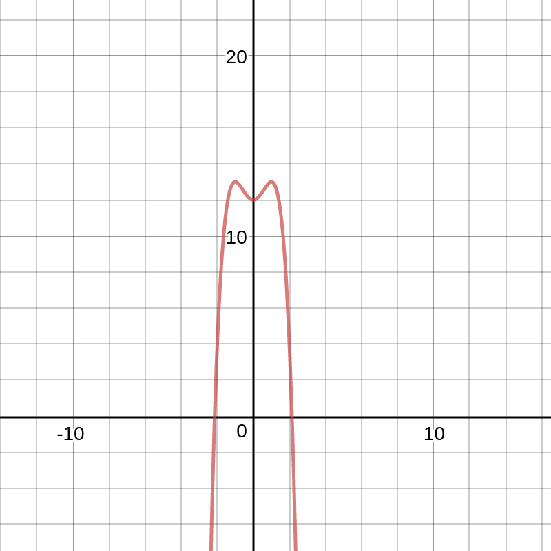
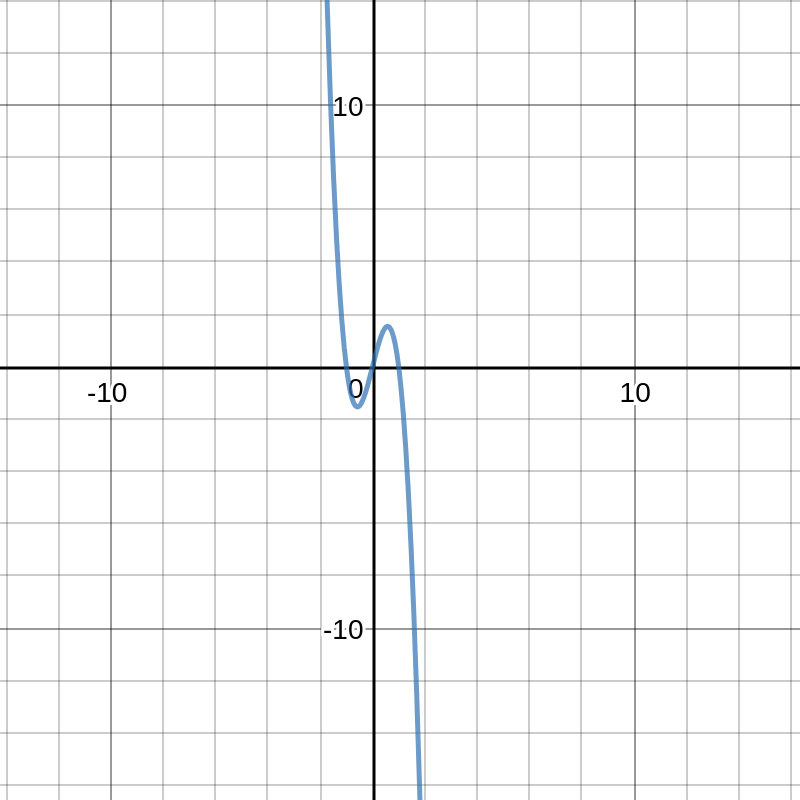
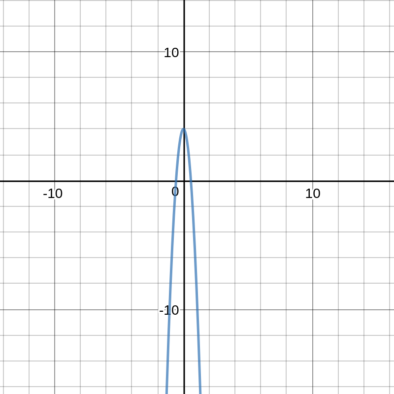

# Finding Local Minimas and Maximas

There are several processes for finding Local Minimas and Maximas. Here, we are only going to cover the calculus method where you find the critical points and evaluate them using the derivative of the derivative. I am going to look at this geometrically, and through formulas. Lets work through an example to understand this concept. In our example we are going to be studying the function $f(x) = 12 + 2x^2 - x^4$ the graph of this function looks like this:

```vega-lite
{
  "$schema": "https://vega.github.io/schema/vega/v5.json",
  "padding": 5,
  "width":500,
  "height":200,
  "signals": [
    {
      "name": "interpolate",
      "value": "monotone"
    }
  ],

  "data": [
    {
      "name": "table",
      "values": [
        {"x": 0, "y": 28, "c":0}, {"x": 0, "y": 20, "c":1},
        {"x": 1, "y": 43, "c":0}, {"x": 1, "y": 35, "c":1},
        {"x": 2, "y": 81, "c":0}, {"x": 2, "y": 10, "c":1},
        {"x": 3, "y": 19, "c":0}, {"x": 3, "y": 15, "c":1},
        {"x": 4, "y": 52, "c":0}, {"x": 4, "y": 48, "c":1},
        {"x": 5, "y": 24, "c":0}, {"x": 5, "y": 28, "c":1},
        {"x": 6, "y": 87, "c":0}, {"x": 6, "y": 66, "c":1},
        {"x": 7, "y": 17, "c":0}, {"x": 7, "y": 27, "c":1},
        {"x": 8, "y": 68, "c":0}, {"x": 8, "y": 16, "c":1},
        {"x": 9, "y": 49, "c":0}, {"x": 9, "y": 25, "c":1}
      ]
    }
  ],

  "scales": [
    {
      "name": "x",
      "type": "point",
      "range": "width",
      "domain": {"data": "table", "field": "x"}
    },
    {
      "name": "y",
      "type": "linear",
      "range": "height",
      "nice": true,
      "zero": true,
      "domain": {"data": "table", "field": "y"}
    },
    {
      "name": "color",
      "type": "ordinal",
      "range": "category",
      "domain": {"data": "table", "field": "c"}
    }
  ],

  "axes": [
    {"orient": "bottom", "scale": "x"},
    {"orient": "left", "scale": "y"}
  ],

  "marks": [
    {
      "type": "group",
      "from": {
        "facet": {
          "name": "series",
          "data": "table",
          "groupby": "c"
        }
      },
      "marks": [
        {
          "type": "line",
          "from": {"data": "series"},
          "encode": {
            "enter": {
              "x": {"scale": "x", "field": "x"},
              "y": {"scale": "y", "field": "y"},
              "stroke": {"scale": "color", "field": "c"},
              "strokeWidth": {"value": 2}
            },
            "update": {
              "interpolate": {"signal": "interpolate"},
              "fillOpacity": {"value": 1}
            },
            "hover": {
              "fillOpacity": {"value": 0.5}
            }
          }
        }
      ]
    }
  ]
}
```



As you can see this function has goes up and then has a small divet at the peak of the function. We can see two local maximas in this graph and one local minima. The local minima is the lowest point in the small divet, and the two local maximas are the peaks at either side of the divet. While we can see this easily through our graph, it is harder to see at what exact points the local minimas and maximas are at, and it is hard to show your work. In order to find these points, we need to find the derivative of the function and the derivative of the derivative of the function. These two diervatives are as follows: $f'(x) = 4x - 4x^3$ $f''(x) = 4 - 12x^2$ The graph of f'(x) looks like this:



The graph of $f''(x)$ looks like this:



As we can see from the graph of the derivative, there are three critical points. These three critical points corespond to the three different extremas of this function that we found earlier. We can look at this mathematically. The derivative looks like this when it is factored: 

$$
f(x) = -4(x)(x-1)(x+1)
$$

 Once you have factored the derivative, it is pretty easy to find the roots. We can easily find the roots by finding when each factor equals 0. The roots are as follows: $x = 0$, $x = 1$,$ x = -1$. If you graph the equation in a graphing calculator you can see that these points match up. These roots correspond to the critical points of the function. Now that we know where the critical points are, lets find out whether each one is a minima or a maxima. While we can easily see this by looking at the graph of the function, it is always good to know how to find these points mathematically. In order to find these functions mathematically, we need to know the derivative of the derivative. For our example, the derivative of the derivative is $f''(x) = 4 - 12x^2$. If the derivative of the derivative is less than 0 then it is a local maximum, and if it is more than 0 it is a local minimum.

1. if $f''(x) \lt 0$ and $x$ is a critical point then $x$ is a local maximum.
2. if $f''(x) \gt 0$ and $x$ is a critical point then $x$ is a local minimum. 

Now that we know these rules we can plug them into our problem and find out whether or not these points are local minimas or local maximas. The list below summarizes our work:

1. $f''(-1) = -4 \gt 0$ this point is a local maximum
2. $f''(0) = 4 \lt 0$ this point is a local minimum
3. $f''(1) = -4 \gt 0$ this point is a local maximum
