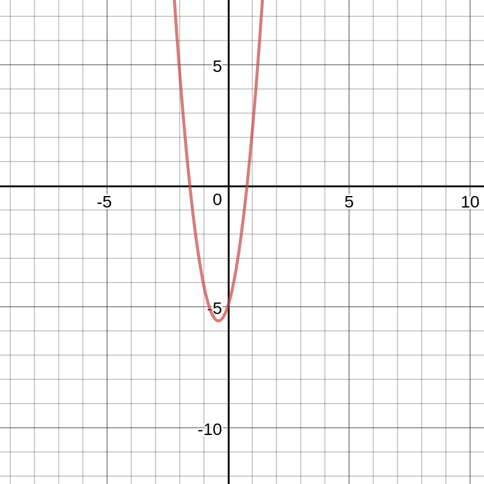
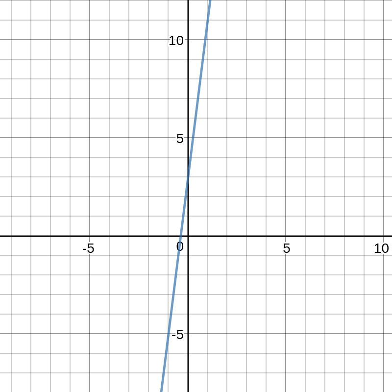

#Functions and Derivatives and their graphs
While you can look at a functions symbols and variables mathematically and do many different manipulations this way, I think that it is very important to look at the geometric explanation for why things like this work. If you understand how something like a derivative works geometrically, I believe that you will have a better understanding in the long run, and it will help you easily obtain knowledge of other mathematical concepts that involve derivatives. So, lets get to it and look at our first example. In the first example we are going to take a quadratic function and its derivative and look at them through a geometric lense. The quadratic function that we are going to look at in the first example is $4x^2 + 3x -5$. The derivative of this function is found using the power rule and the derivative rules of addition and subtraction. The derivative of this function can be found as follows:
$$f(x) = 4x^2 + 3x - 5$$
$$f'(x) = 2(4)(x)^{2-1} + 1(3)(x)^{1-1}$$
$$f'(x) = 8x + 3$$
The graph of the original function, $f(x) = 4x^2 + 3x - 5$, looks like this:

The graph of the derivative, $f'(x) = 8x + 3$ looks like this:

As we can see from the graphs the original graph is a quadratic function, and we can look at this mathematically, but we can also look at this graphically and see that this graph is quadratic a fair amount faster. We can tell from looking at the second graph that the derivative of the function is a linear function. By looking at the graph of the derivative, we can see that there is a 0 at point fairly close to 0. A point where the derivative is equal to 0 is called a *critical point*. An extremum of a function, a high point or a low point is always on a critical point. Not all critical points are extremas, but it does narrow your search down significantly. Without looking at the graph, we can also find a critical point, but it is much easier to see them on a graph. In order to find them without graphing the derivative, we can follow a process similar to this:
$$f'(x) = 8x + 3 = 0$$
$$8x = -3$$
$$x = -0.375 = -\frac{3}{8}$$
While looking at the graph may not give you an accurate x value of where the critical point lies, it does give you a very good idea of where it is, and where to look. It also gives you an idea of whether or not there is a critical point at all. By looking at a graph of a function and its derivative rather than just looking at a function, we can also find some interesting conjectures. For example, we can see that the original function is quadratic, and that the derivative is linear. We can find the derivative of a quadratic function completely algebraiclly, and create a conjecture. First of, lets look at finding the derivative algebraiclly. It looks like this:
$$f(x) = ax^2 + bx + c$$
$$f'(x) = 2ax^{2-1} + 1bx^{1-1}$$
$$f'(x) = 2ax + b$$

$c$ got cancelled out because it is a constant.

as we can see, the diervative of a quadratic function will always be linear. Since we now know this we can create two different conjectures. They look like this:

1. A quadratic function's derivative will always be a linear function.
2. A quadratic function's derivative will always be $2ax + b$ if $f(x) = ax^2 + bx + c$$

While we can find these things without looking at a graph, it helps very much to be able to look at a graph and interpret the results.