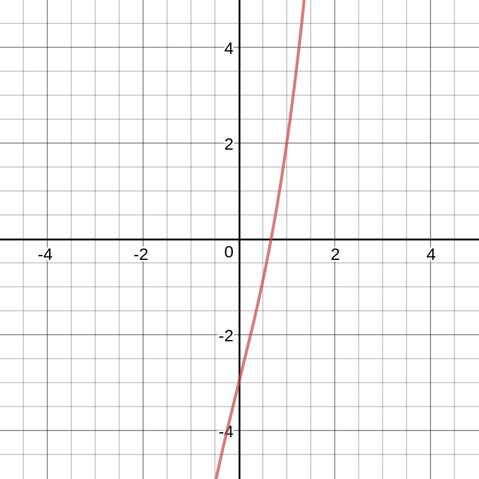

# Newton's method

Newtons method allows you to approximate the solution(a real zero) to an equation given an initial estimate. Newton's method is an iterative process. Newton's method involves finding the derivative of a function and using it to find the solution you are looking for. Newton's method can be stated as follows:

If $f$ is a differentiable function and $r$ is a zero of $f$ that is real and $x_n$ is an approximation to $r$ then the next approximation $x_{n+1}$ is given by:

$$
x_{n+1}=x_n-\frac{f(x_n)}{f'(x_n)}
$$

One quirk to newtons method is that it does not guarantee that $x_{n+1}$ is a better approximation of $r$ than $x_n$. You must also be careful in choosing the first approximation. Make sure that $f'(x_n)$ is not close to 0 when making your initial prediction. Newton's method also does not work when $f'(x_n)$ equals 0. Here is a general guideline when using newton's method: If you need an accuracey of $k$ decimal places you should approximate each of the successive iterations to $k$ decimal places and stop iterating when two successive iterations are the same. Now, lets look at an example.

## Example 1

In this example we are going to use Netwon's method to approximate the real zeros of the function $f(x) = x^3 + 4x - 3$. The derivative of this function is $f'(x) = 3x^2 + 4$. The graph of $f$ looks like the following:

We are going to make an initial estimate of 0.7. When we set up Newton's formula it looks like this: 

$$
x_{n+1} = x_n-\frac{x_{n}^3 + 4x_n - 3}{3x_{n}^2 +4}
$$

Plugging our value 0.7 into this formula, we get this:

$$
x_2 = 0.7-\frac{0.7^3+2.8-3}{2.1^2+4}=0.683
$$

$$
x_3 = 0.683-\frac{0.683^3 + 2.732 - 3}{2.049+4}=0.67683
$$

$$
x_4 = 0.67683-\frac{0.67683^3 + 2.7073 - 3}{2.0305+4}=0.67469
$$

 While we did not follow our previously established guidelines, we did get a pretty good approximation of the zero. This is a very simple demonstration of Newton's method and it works pretty well.
