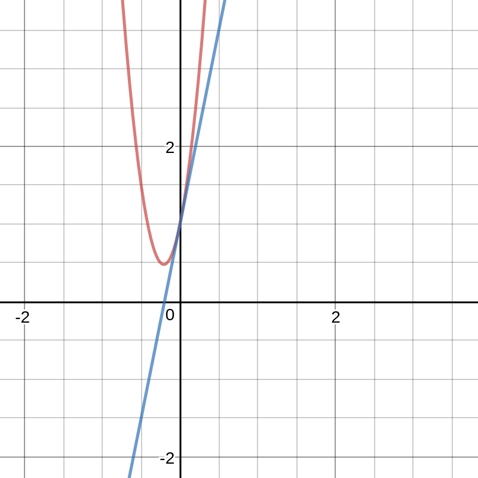

#Tangent Lines
Tangent lines are quite useful in  many situations when you need to analyze a function. They can also give you a better understanding of how certain concepts work such as concaves. In order to create a tangent line you need to know two things: point slope form $y - y_1 = m(x - x_1)$ and a fairly good knowledge of derivativies. Now that you know what you need to get started, lets talk about what a tangent line actually is. A tangnet line is a line that intercepts a function at a specific point and has the same slope as the function does at that point. For example, in the graph below the function(in blue) has a tangent line(in red) at the point(0,1).

The tangent line in this graph has the same slope as the function does at the point where it intercepts the function. Another thing that needs to be considered is what if the tangent line intercepts multiple points of the function? Well, this is usually handled by saying that the point that the tangent line is based off of has the same slope as the tangent line. Now that we know what a tangent line is lets look at how to calculate them. In order to find the formula for a tangent line we need to know what point we are going to  base the tangent line off of. This point needs to be on the function $f(x)$. We also need to know the slope at this point. This is usually found by calculating the derivative. To show how to do this algebraically, let $(x_1,y_1)$ represent the point we want to base the tangent line off of. Let $m$ represent the slope of the function at the point $(x_1,y_1)$. We can find the equation for the tangent line like this:
$$m = f'(x_1)$$
After we know the slope we can find the formula for the equation representing the tangent line:
$$y - y_1 = m(x - x_1)$$
As you can see this is the exact same formula as point slope form, but we had to find the variables differently than we normally would. Now, lets look at an example to further our understanding of the concept. In our example problem we are going to find the tangent line at the point $(0,7)$ in the function $f(x) = 3x^2 + 1x + 7$ If we plug in the value 0 we will get the value 7 just like we expect proving that this function is a valid function.
$$f(0) = 3(0)^2 + 1(0) + 7$$
We can also look at the graph to see that this is a real point:

Now that we know the point exists, we can find the slope at this point. We can do this by plugging the x value into the derivative. I am not going to cover how to find derivatives and I am simply going to show you the derivative. The derivative of this function is $f'(x) = 6x + 1$. If we plug our x value(0) into this formula we get the answer 1. This means that the slope of the function at this point is 1. If we plug this into the point slope formula we get this formula:
$$y - y_1 = m(x - x_1) = y - 7 = 1(x - 0) = y = x + 7$$
So we can see from this that the formula for our tangent line is $y = x + 7$. We can verify this by graphing the formula and the graph. The two functions on the same graph look like this:

As we can see, the functions have the same slope at that point and they also intercept the same point.