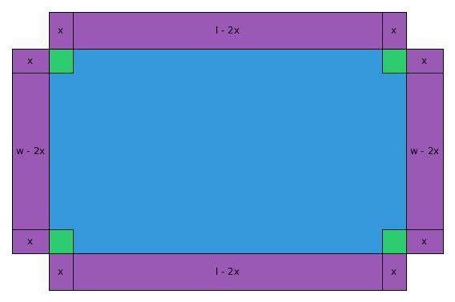

#The Cereal Box Problem
The cereal box problem is an interesting problem that I was introduced to in 6th grade. The problem is stated as follows: you have a finite amount of cardboard(surface area) and you need to maximize the volume. We can solve this problem by using derivatives. This type of problem is called an optimization problem. In order to do this we need to setup the problem in the form of a function, find the derivative and the derivative of the derivative of this function, and then finally find the critical points of the derivative and make sure they are in the domain of the function and make sure that they are local maximas. So without further ado lets get to it.
##The problem examined graphically
While this problem might be pretty interesting, especially if you are working at a cereal factory right now designing a box, it helps a lot if we examine this problem with a diagram. Here is what the diagram of the box looks like:

The green pieces represent the area of the cardboard that will be cut away. The purple areas do not indicate any surface area, they are rather textboxes that given length or width of a specific quadrilateral. A animation of a box like this folding together looks like this:

Now, you might notice that there is no top. We are not going to include a top in our calculations as I think it adds unneeded complexity. Now, lets look at describing this formula mathematically.
##Describing our box mathematically
Now, lets describe our box mathematically. The only function that I am going to list here is the function for volume. It is as follows:
$$f(x)=x(l-2x)(w-2x)$$
Or expanded, the function looks like this:
$$f(x) = 4x^3 - 2lx^2 - 2wx^2 + lwx$$
Now that we know what the formula for volume is, lets take the derivative of this function and find its critical points. The derivative of this function looks like the following:
$$f'(x) = 12x^2 - 4lx - 4wx + lw$$
If you are trying to find this derivative on your own make sure you treat $l$ and $w$ as constants and not variables. You may also want to try and find the derivative of this function with $l$ and $w$ replaced with real values and then try and abstract it. Now that we know what the derivative looks like, lets find the critical points. We can use the quadratic formula to do this as the derivative takes the form of a quadratic. Plugging everything into the quadratic formula and simplifying gives us this:
$$
x = \frac{1}{6}l + \frac{1}{6}w \pm \frac{1}{6}\sqrt{l^2+w^2-lw}
$$
This is provided that the discriminant $16l^2 + 16w^2 - 16lw$ exists. Now that we have established a generalized method for finding the critical points we need to know if they are even within the domain of our function.
We can describe the domain of our function as $0 \le 2x \le w$. This limit makes sense because we cannot have negative lengths, and we cannot have our 2 small boxes that we are cutting away be bigger than the smaller side(the width). Now, lets look at the derivative of the derivative. The derivative of the derivative looks like this:
$$
f''(x)=24x-4l-4w
$$
Now, a quick review of the second derivative test. If $f''(x) > 0$ then $x$ is a local minima and if $f''(x) \lt 0$ then $x$ is a local maxima. Now that we know all this we can look at an example problem.
##Example
In our example our length will be 5 units and our width will be 3 units. We can find the volume of our box by plugging our values into this formula:
$$f(x) = 4x^3 - 2lx^2 - 2wx^2 + lwx$$
Plugging our values in the formula looks like this:
$$f(x) = 4x^3 - 4x^2 + 15x$$
Now that we know the formula for our volume we can take the derivative of this function or plug our existing values into our abstract derivative that we created earlier. Either way, the derivative looks like this:
$$f'(x) = 12x^2 - 32x + 15$$
Again we have multiple choices with how to proceed. Except this time we have three. First, we could plug these values into the quadratic formula. Second, we could plug these values into the formula that we created for finding the roots of our derivative, or we could graph this function and find the zeros this way. The zeros of this function are 0.607 and 2.06. Since neither of these values are negative we have to plug these values into our inequality and make sure they work. Our inequality looks like this:
$$0\le2x\le$$
Plugging the second value, 2.06, into the inequality we get:
$$
\require{cancel}
0\le4.12\cancel{\le}3
$$
This means that we can eliminate the value 2.06. Now, lets verify that the value 0.607 works:
$$
0\le1.214\le3
$$
Now that we know it works in our inequality lets make sure that it is a local maxima. In order to do this we can use the second derivative test. I am only going to restate part of the second derivative test here. If $f''(x) \lt 0$ then $x$ is a local maxima. In our case $f''(0.607) = -17.432$. So by the second derivative test $x$ is a local maxima and we have found our answer. We should fold each edge in 0.607 units in order to create a cereal box with the maximum amount of volume with our dimensions.