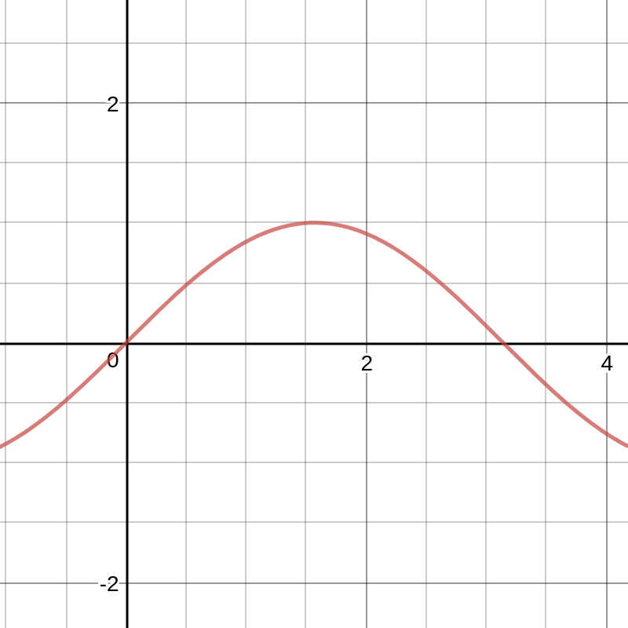
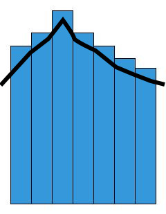
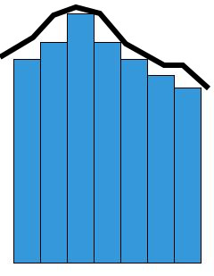

#Using sums to find the area under the curve
In the last note set I showed you how we can use different mathematical formulas to solve summations without figuring out every single term. I also showed you the notation. In this note set I am going to show you how to use sums to find the area under the curve. However, this method has some limitations as we will see. First, lets look at some variables that will be used.
##Some variables
1. Our function in this case will be $f$.
2. $A_{cp}$ means the area under the curve with our rectangles being circumcised. We will get to what this means in a minute.
3. $A_{ip}$ means the area under the curve with our rectangles being inscribed. We will also get to what this means in a minute.
4. We will be finding the area under the curve in the set $[a,b]$.
5. $f(u_k)$ is the minimum value of $f$ on $[x_{k-1},x_k]$.
6. $k$ is the index of the summation.
7. $\Delta x$ is the width of each rectangle/the width of each area that we are going to sum.
8. $f(v_k)$ is the maxmimum value of $f$ on $[x_{k-1},x_k]$
##Rectangles
We use rectangles to approximate the area under the curve when we use summations. If we have a graph of a function like this(we are only going to look at the posotive areas):

We can approximate the area under the curve by using successively smaller rectangles. That start at the $x$ axis, go up to the curve, and have a width of $\Delta x$. The sum of these rectangles will give you the approximate area under the curve.
##Inscribed vs Circumcised
Now that we know what rectangles are, lets look at the difference between inscribed rectangles, and circumcised rectangles. When we are creating rectangles, we need to have a height for them. In our method currently, we are creating rectangles of width $\Delta x$ and a height of the maximum value of $[x_{k-1},x_k]$ or the minimum value of $[x_{k-1},x_k]$. This is the difference between inscribed rectangles and circumcised rectangles. If we are using inscribed rectangles, we are setting the height of the rectangle to the minimum value of the function in the interval $[x_{k-1},x_k]$. If we are using circumcised rectangles, we are setting the height of the rectangle to the maximum value of the function in the interval $[x_{k-1},x_k]$. Now, lets look at some images.
A graph in which the area under the curve is being calculated with circumcised rectangles would look like this:

A graph in which the area under the curve is being calculated with inscribed rectangles would look like this:

##The summation
The formula for the summation we are going to introduce has many different limitations. These limitations are as follows:
1. $f$ has to continuous on the interval $[a.b]$
2. $(x)$ cannot be negative on any $x$ in $[a,b]$
3. all subintervals of $[a,b]$ must have the same length $\Delta x$
4. $w_k$ has to be the minimum or maximum value of $[x_{k-1},x_k]$
However, in the next note set we are going to look at Riemann sums which do not have these limitations. While Riemann sums may be more powerful, we still need to look at using sums to find the area under the curve. Finding the area under the curve using inscribed rectangles looks like this:
$$
A_{ip} = \sum_{k=1}^{n}f(u_k)\Delta x
$$
Finding the area under the curve with circumcised rectangles looks like this
$$
A_{cp} = \sum_{k=1}^{n}f(v_k)\Delta x
$$
The formal defintions of these involve limits. I am going to list them here for reference, but basically, both of them approach the actual area $A$ as $\Delta x$ decreases. Here are the actual definitions:
$$
A = \lim_{\Delta x \to 0}\sum_{k=1}^{n}f(u_k)\Delta x
$$
$$
A = \lim_{\Delta x \to 0}\sum_{k=1}^{n}f(v_k)\Delta x
$$
This is basically saying that for every $\epsilon$(error rate) $> 0$ there is a $\delta > 0$ such that $0 < \Delta x < \delta$.
##Conclusion
So as we have seen, we can use summations in order to calculate the area under the curve. While the methods we were using in this note set are not as powerful as Riemann sums or the fundamental thereom of calculus they are still useful to know. In the next note set we are going to look at Riemann sums and then after that we are going to look at the fundamental thereom of calculus which allows you to find the actual area under the curve($A$) using anti-derivatives.