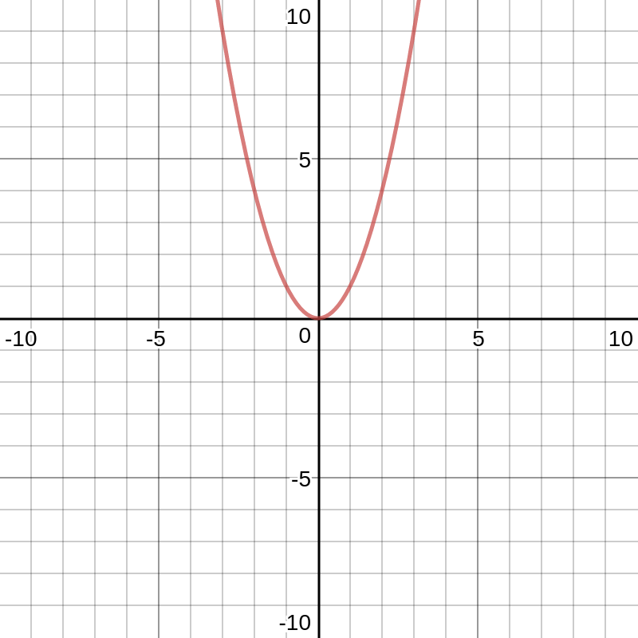

Knowing whether or not a function is in a downwards concave or an upwards concave is pretty useful. In order to this we can take the derivative of the derivative $$f''(x)$$ of a function and if it is greater than zero than it is concaving upwards but if it is less than zero than the function is concaving downwards. In order for this rule to be true the function has to be differentiable on the interval that you are analyzing. 

If the derivative of the derivative of the function exists on an open interval I, then the graph of f is

1. experiencing a upwards concave on I if
$$f''(x) > 0$$
2. experiencing a downwards concave on I if
$$f''(x) \lt 0$$

This actually makes quite a bit of sense. The derivative of a function finds the slope at a specific point. If we take the derivative of the derivative we can look at the slope at a specific point of the derivative. Basically, if the slope of the derivative is greater than 0 then we are going up and if it is less than 0 we are going down. If it is equal to 0 then we are either on a flat point of the function or a peak. Now, lets look at some examples.

If we look at the function:
$$f(x) = x^2$$
We can see that its derivative is $$f'(x) = 2x$$ and the derivative of the derivative is $$f''(x) = 2$$ From this we can see that the the derivative of the derivative is always posotive so the function will always be in an upwards concave. We can examine this graphically by looking at the graph of the original function.

As you can this function goes upwards indefinitely and it always concaves upwards. I am not going to provide any proofs but I think this examples is fairly neat.