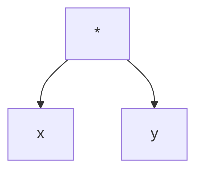
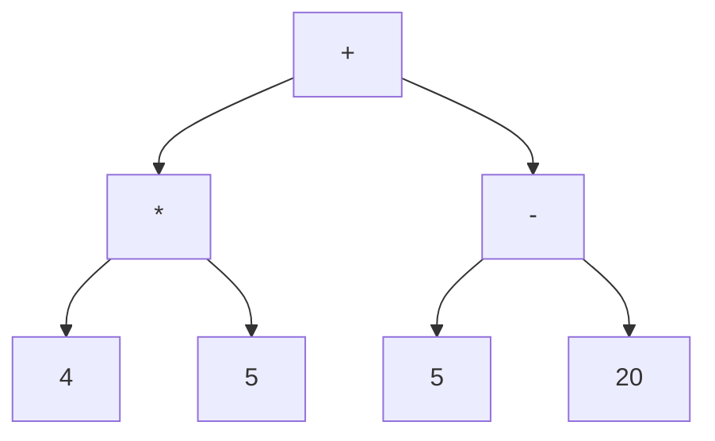

# Converting algebraic expressions into expression trees.

Algebraic expression in their raw text form look something like this: $ax^2+3x+2x+c$, or something similar. Sometimes we wish to simplify these expressions into their simplest form(eg $ax^2+5x+c$). In order to have a computer do this automatically for us, we need to transform the algebraic expression we want to manipulate into one of several different formats. In this article, converting algebraic expressions/equations into expression trees will be discussed. In order to kickstart this process, we first need to look at what these equations look like in raw text without any fancy formatting.

#### Infix notation

The standard format that we use to type out algebraic expressions in day to day life is called infix notation. In infix notation, the operators are placed in between the operands(numbers or variables) that the operate on. While infix notation does work quite well when we are writing down expressions for humans to read, it does not work that well when we need to write a program to manipulate the operators and operands because it is much harder to parse. Two of the most commonly used formats for storing algebraic expressions/equations for manipulation by a program are reverse polish notation and polish notation. We will take a look at these formats in a second, but first we will look at what infix notation looks like in raw text without any formatting

#### Infix notation in raw text

In raw text, we have to use operators such as `^` and `/` instead of the more conventional ways to write down mathematical formulas such as placing the exponent to the top right of the base($x^y$), or putting the divisor beneath the dividend($\frac{x}{y}$). While we can technically parse mathematical expressions with fancy formatting into raw text quite easily, it is highly dependent upon the formatting used, and thus outside the scope of this article. When we write down functions in raw text, we usually abbreviate them(though the full name can be used, you just have to write your lexer differently), with parentheses surrounding the input to the function. For example, in raw text, the sine function operating on the value $2x$ would be written like this: `sin(2x)`. Now that the concept of writing down expressions in raw text has been introduced, most of the following equations will be written using this format. Now lets move on to looking at polish notation and reverse polish notation.

#### Lexing - Converting expression/equations from raw text into a series of tokens

The raw text that is supplied into the program needs to be lexed, or converted from the raw text into a series of "tokens", or elements in an array that can be passed on the parser, which will process these tokens into reverse polish notation(more on that later). Lexing is quite simple. It consists of a program that goes through the raw text character by character, seperating out all the different parts. The lexer that needs to be implemented in order to generate expression trees from infix notation(in raw text) has to be able to seperate out the functions, operators, parentheses, and operands. The pseudocode for a basic lexer looks like this:

```
string currentToken
array output
for each charcter in input
    if character is letter
        currentToken = currentToken + character
    if character is number
        currentToken = currentToken + character
    if character is parenthese
        if character is space and currentToken is not blank
            push currentToken to output
        push character to output
    if character is operator
        if character is space and currentToken is not blank
            push currentToken to output
        push character to output
```

This is a very basic lexer, not supporting numbers including a decimal, malformed input(this lexer will sometimes badly handle spaces in the input), among other problems. But, not much functionality has to be added in order to make this lexer fully functional and ready for production use. Depending upon the programming language that you are using, you might also want to add in some additional logic to parse the strings into different data types(eg integers).  

#### Polish notation and reverse polish notation

Unlike in infix notation, polish notation has the operators preceed the operands that they are operating on. Instead of writing an expression such as `3+4` with the operator `+` in the middle, the operator is put in front of the operands like this: `+ 3 4`(space put in between the operands/operator for clarity). Reverse polish notation is almost exactly the same except the operator is put after the operands. The previous example of `3+4` would be written as `3 4 +` in reverse polish notation. Another important thing to note is that when you convert an expression/equation from infix notation into (reverse) polish notation, no parentheses are needed(when each operator/function has a fixed number of operands). When we parse infix notation into (reverse) polish notation all of the parentheses are removed because the order of the operators and operands carries enough information such that we do not need parentheses in order to indicate which order we should carry operations out in. Reverse polish notation will be used as an intermediary between infix notation and expression trees because it is much easier to convert infix notation to reverse polish notation with the shunting yard algorithm than to convert infix notation to polish notation. For this reason the algorithms that follow will be shown in terms of reverse polish notation.

#### Precedence, Associativity, and input count of operators and functions

One thing that needs to be covered before the introduction of the shunting yard algorithm(the algorithm that converts infix notation into reverse polish notation) is that of operator associativity and of operator precdence. This determines in which order operations are performed when there are no parentheses indicating which order the operations should take place in. Operators can have left associativty, or right associativty. If we take an expression such as $a$~$b$~$c$ with ~ representing an operator, the way this expression would be grouped with left and right associativity can be analyzed. If the operator ~ is left associative, the expression would be grouped as follows $(a$~$b)$~c. If the operator ~ is right associative, then the expression would be grouped as follows: $a$~$(b$~$c)$. The following table shows the five main operators($+$,$-$,$\times$,$\div$,$\wedge$):

| Operator | Associativity |
| -------- | ------------- |
| $+$      | Left          |
| $-$      | Left          |
| $\times$ | Left          |
| $\div$   | Left          |
| $\wedge$ | Right         |

Now that associativity has been covered, operator precedence will be analyzed next. Operator precdence describes how to group different operators in the absence of parentheses. Operator precdence is tightly connected to the order of operations with operators occuring first in the order of operations having a high precdence, and operators occuring later on in the order of operations having a lower precedence. The following table shows the five basic operators and their corresponding precdences

| Operator | Precedence |
| -------- | ---------- |
| $+$      | 2          |
| $-$      | 2          |
| $\times$ | 3          |
| $\div$   | 3          |
| $\wedge$ | 4          |

The only other property for the purposes in this article that operators and functions have is the number of inputs that they take. This property will be used later on when expression tree algorithms are considered. All of the five basic operators each take two inputs, and all of the trigonometric functions take one input.

#### Converting infix notation into reverse polish notation - The shunting yard algorithm

Converting Infix notation into postfix notation is done using an algorithm called the shunting yard algorithm. The shunting yard algorthim is named because it slightly resemebles an actual shunting yard, a mechanical system used to organize rail cars. The psuedocode for the shunting yard algorithm looks like this:

```
array tokens
stack operators
array output
for token in tokens
    if token is an operand
        push token to output
    if token is a left parenthese
        push token to operators
    if token is a right parenthese
        while top of operators is not a left parenthese
            push top of operators to output
            pop operators
        pop operators
    if token is an operator and (sizeof operators is 0 or top of operators is a left parenthese)
        push token to operators
    if token is an operator and the operators precdence is higher than the precdence of the operator at the top of operators or (token is an operator and has the same precdence as the operator on the top of the stack and is right associative)
        while token is an operator and the operators precdence is lower than the precdence of the operator at the top of operators or (token is an operator and has the same precdence as the operator on the top of the stack and is left associative) or the token is a function
            push top of operators to output
            pop operators
        push token to operators
while operators is not empty
    push top of operators to output
    pop operators
```

#### Evaluating reverse polish notation

theWhile evaluating an expression/equation in reverse polish notation is not the primary focus of this article(the algorithm for expression trees is a fair bit simpler), it will be covered because it is a fairly valuable piece of information to know for testing, and also if there is no need to do the kind of manipulation that requires an expression tree. The algorithm for evaluating reverse polish notation uses a stack and is written in terms of tokens. The algorithm is as follows:

```
stack tokenStack
for token in inputTokens
    if token is operator
        operand2 = pop from tokenStack
        operand1 = pop from tokenStack
        result = evaluate(token,operand1,operand2)
    else if token is operand
        push token onto tokenStack
result = pop from tokenStack
```

This algorithm does not support operators that have a different number of operands, but as this is not the focus of this article, and further resources are easy to find online.

#### Converting reverse polish notation into an expression tree

Now that the process of converting infix notation into reverse polish notation has been discussed, the process for converting reverse polish notation into an expression tree can now be shown. The process for this is shown as a recursive algorithm:

```
function convertRPNIntoExpressionTreeNode(stack input)
    expressionTreeNode node
    value of node = pop from input
    for i = number of inputs in value of node
        add convertRPNIntoExpressionTreeNode(input) to subnodes of node
    return node
```

This algorithm is quite simple in its recursive form. It relies on knowing the number of inputs for each node(to discern between functions requiring one input and operators requiring two), and a stack containing the tokens of an expression in reverse polish notation. 

#### Evaluating an expression tree

Many tree algorithms are recursive, and the algorithm to evaluate an expression tree is no different. While it may not always be implemented recursively in practice(because of problems with deep recursions in some languages causing a stack overflow), in theory it is a fair bit simpler to think of this algorithm in its recursive form. The algorithm for evaluating an expression tree looks something like the following:

```
function evaluateNode(node input)
    if value of input is constant
        return value of input
    else if value of input is a function
        return function(value of input, evaluateNode(subnode of input))
    else if value of is an operator
        x = evaluateNode(second subnode of input)
        y = evaluateNode(first subnode of input)
        return operator(value of input, x, y)
```

This function shows the basics without going too deep into some of the implementation details. The `function` function that we are using to evaluate functions takes in the type of function(`value of input`), and a single subnode(`subnode of input`). This assumes that functions are only taking in a single input, but many of the simpler ones do(eg $\sin$, $\cos$, etc.) We do something similar with the operators, with the `operator` function taking in the operator(`value of input`), and the two subnodes. You might know that they are backwards with `x` being set to the second subnode while `y` is being set to the first subnode. If this needs to be fixed, a simple recursive algorithm can easily reverse the order of all of the subnodes in the tree making it so that `x` is the first subnode and `y` is the second subnode.

#### Manipulations on an expression tree

This is one of the better uses for expression trees. You can convert an infix expression into an expression tree simply to evaluate the expression, but this is an inefficient use of computational resources. Expression trees do not really shine until an attempt to modify the expression is made. Expression trees allow for the efficient search and modification of expressions(and equations). This allows for the creation of algorithms that can do things like simplify algebraic expressions, among many other things. For example, shown below is an algorithm that substitutes all nodes with a specific value with a different value:

```
function replaceNodeValue(inputNode, value)
    if value of inputNode is equal to value
        value of inputNode = value
    for each subnode of inputNode
        replaceNodeValue(subnode, value)
```

This shows the power of recursive algorithms on trees. With just five lines of pseudocode(and about the same in an actual implementation), we can create an algorithm that can do substitutions. While this algorithm might not be the most useful thing(only able to replace values), we could easily extend this algorithm from instead of just changing the node's value to changing the node into an entirely new tree, which would be useful in doing things like computing composite functions. Another thing that expression trees allow for is the effective search of expressions using a template tree. If we take a tree like the following:



Where $x$ and $y$ are variables, thus matching anything. When we apply this template tree to an expression tree, it will match all nodes involving multiplication(of two elements, but the parsers that have been discussed previously do not support more than two operands). If we apply it to the below tree:



The previously shown template tree will match the left subnode of the root node. Once we have matched a node, we can then apply a rule to it, simply delete the node, replace the node, or do any number of things for it. This is what makes expression trees so powerful, because with pattern matching you can easily manipulate expressions. The algorithm for seeing if a template tree matches any nodes in an expression tree(with breadth first search) looks like the following:

```
function FindTemplateTreeInTree(tree, templatetree)
    queue nodeQueue
    push root node of tree to nodeQueue
    while nodeQueue is not empty
        if value of top of nodeQueue = value of root node of templatetree
            if areNodesEqual(top of nodeQueue, root node of templatetree)
                return top of nodeQueue
        for each subnode in top of nodeQueue
            push subnode to nodeQueue
 
function areNodesEqual(aNode, bNode)
    if value of aNode = value of bNode
        if size of subnodes = 0
            return true
        else
            for each subnode in aNode
                if areNodesEqual(subnode, aNode) = true
                    return true
    else
        return false
```

This algorithm uses two functions. The `areNodesEqual` function is a simple recursive algorithm that tests if the two trees are equal to each other by testing their values(more logic would need to be added in to the value equivilance check to see if there is a variable if intended behavior is that variables match everything), and the first function `FindTemplateTree` uses a breadth first search algorithm(depth first search would work as well) to search for nodes that are equal to the rootnode of the template tree, and if they are it then checks to see if the subnodes of that node are equal to the subnodes of the root node of the template tree. 

#### Conclusion

Expression trees are not the best solution for everything. If the only thing that is desired is a way to evaluate expressions, expression trees should not be used. The expression should simply be converted into reverse polish notation and then evaluated from there. However, if capabilities to manipulate the expression are desired, expression trees are one of the best ways to do that. Some of the basic algorithms regarding trees/expression trees were covered in this article and much more information is available online(that is probably better than what is written here).
